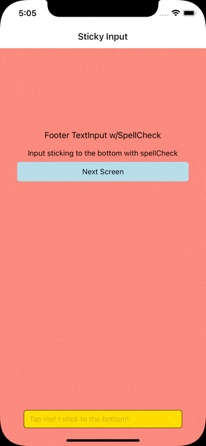

# ReactNativeKeyboardAvoidDemo
Examples of ways to avoid that keyboard using core `KeyboardAvoidView` component. This is a React Native project, you can pretty much copy this for Expo.

## Demo

## Environment setup
Follow instructions on how to setup your environment [reactnative.dev](https://reactnative.dev/docs/environment-setup)

## Get this running
1. Clone repo,  `cd ReactNativeKeyboardAvoidDemo` 
2. Install libraries, `yarn` or `npm i`
3. Install Pods for iOS `npx pod-install` or `cd ios && pod install && cd ..`
4. Start by launching a bundler first `npx react-native start`
5. Run iOS by `npx react-native run-ios`
6. Run android by `npx react-native run-android`

## How to use
Navigate the app and interact with the TextInput boxes to see how the keyboard is presented. Feel free to copy the code.

## Issues
Feel free to submit issues and enhancement requests.

Please use [Issues Support](https://github.com/jimji1005/ReactNativeKeyboardAvoidDemo/issues) to report bugs and errors.

## Contributing
Please refer to each project's style and contribution guidelines for submitting patches and additions. In general, we follow the "fork-and-pull" Git workflow.

 1. **Fork** the repo on GitHub
 2. **Clone** the project to your own machine
 3. **Commit** changes to your own branch
 4. **Push** your work back up to your fork
 5. Submit a **Pull request** so that we can review your changes

NOTE: Be sure to merge the latest from "upstream" before making a pull request!

## Copyright and Licensing

MIT

## Todo
- [ ] Add android support
- [ ] Add android gif